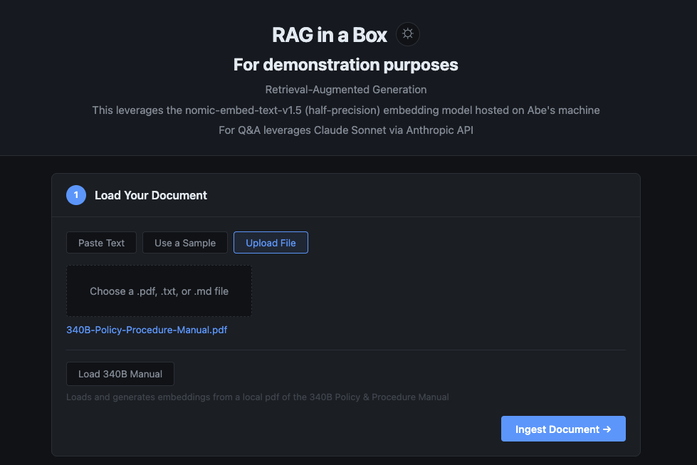
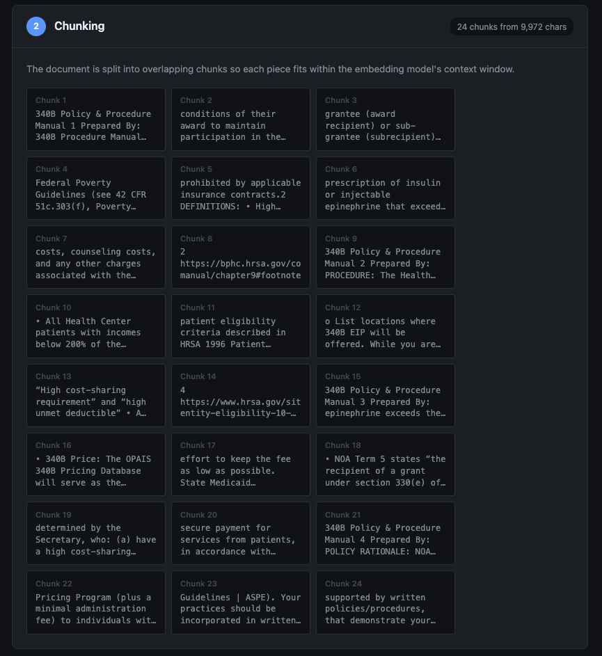
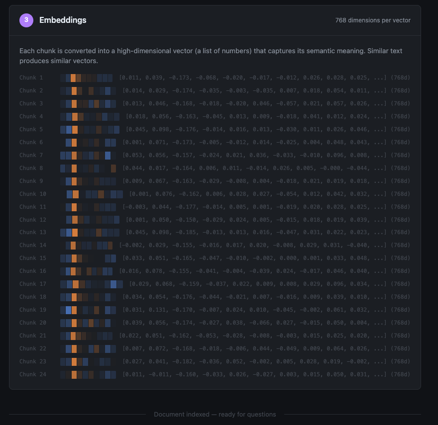
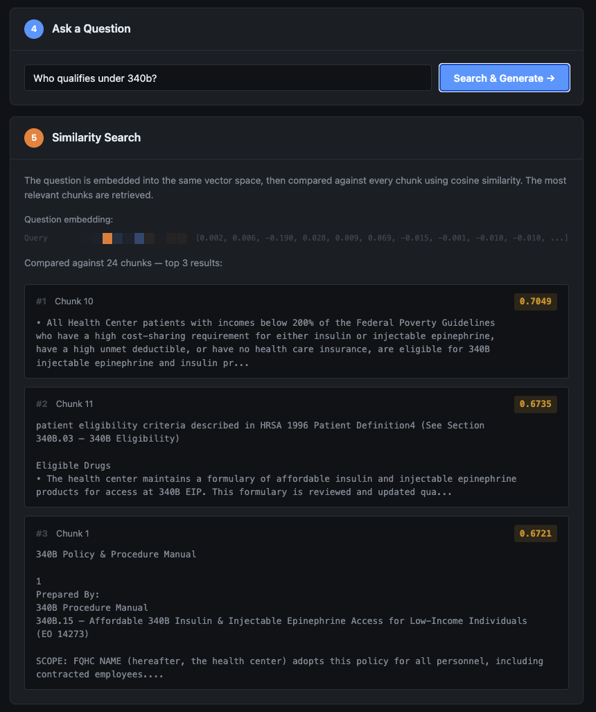
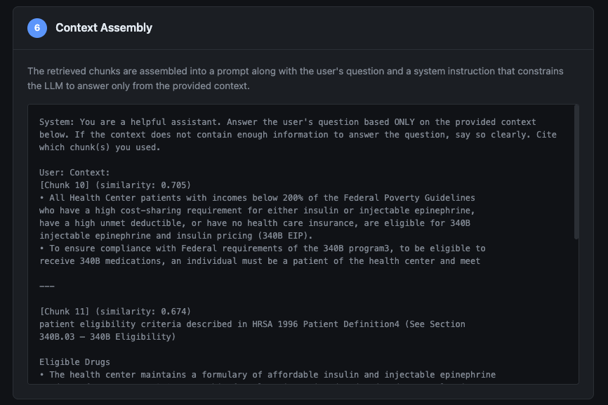
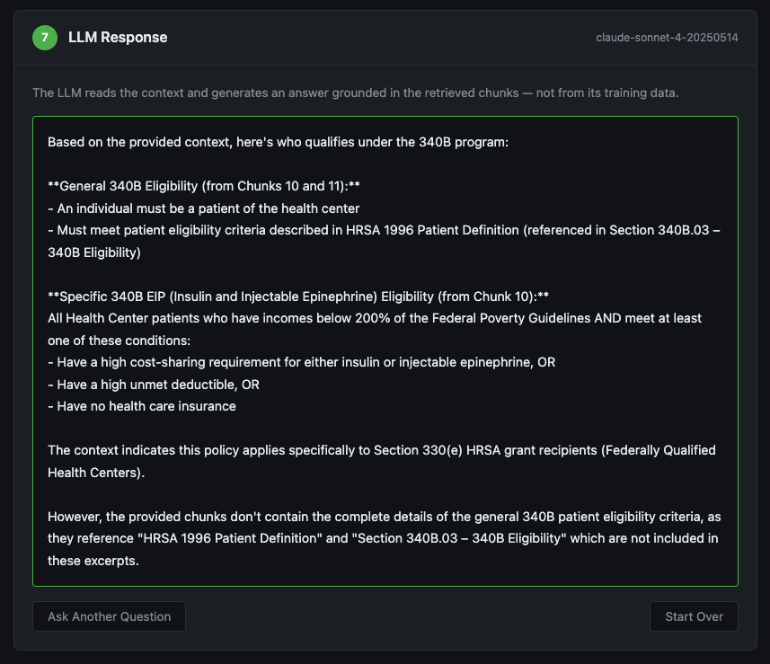

# RAG in a Box

A visual RAG (Retrieval-Augmented Generation) demo that walks you visually through every stage of the pipeline in the browser:
- document loading
- chunking
- embedding
- similarity search
- context assembly
- LLM generation

This is a learning tool meant to be run locally. It has not been rigorously reviewed for security.

## Preview








## TL;DR
You upload a document, and the app shows you exactly what happens at each step instead of hiding it behind an API call. It runs on your machine so you can get or explain a rough idea of how basic RAG works.

## What's in here

- **FastAPI** backend serving a single-page frontend
- **LM Studio** integration (you need LM studio & the model) for local embeddings (nomic-embed-text-v1.5 by default)
- **Claude** (Anthropic API) integration for the generation step - you could fork this project and adapt it to another LLM provider easily
- In-memory vector store using cosine similarity (numpy)
- Supports PDF, plain text, and markdown file uploads
- Comes with a few sample documents so you can try it without uploading anything

## What you need

- Python 3.14+
- [uv](https://docs.astral.sh/uv/)
- [LM Studio](https://lmstudio.ai/) running locally with an embedding model loaded (nomic-embed-text-v1.5 works well) - LM studio can expose a local inference endpoint
- An [Anthropic API key](https://console.anthropic.com/)

## Setup

```bash
git clone https://github.com/aflansburg/raginabox.git
cd raginabox
uv sync
```

Create a `.env` file in the project root (check `.env.example` for reference):

```
ANTHROPIC_API_KEY=your-key-here
```

Start LM Studio and load an embedding model (I suggest `nomic-embed-text-v1.5` half-precision if your machine can handle it) + serve it, then run the app:

```bash
uv run main.py
```

Open [http://localhost:8000](http://localhost:8000) in your browser.

## Configuration

All of these are optional. The defaults work fine if you're running LM Studio locally with `nomic-embed-text-v1.5`.

| Variable | Default | Description |
|---|---|---|
| `ANTHROPIC_API_KEY` | (required) | Your Anthropic API key |
| `RAG_EMBEDDING_BASE_URL` | `http://localhost:1234/v1` | LM Studio API base URL |
| `RAG_EMBEDDING_MODEL` | `nomic-embed-text-v1.5` | Embedding model name |
| `RAG_LLM_MODEL` | `claude-sonnet-4-20250514` | Claude model for generation |
| `RAG_CHUNK_SIZE` | `500` | Characters per chunk |
| `RAG_CHUNK_OVERLAP` | `50` | Overlap between chunks |
| `RAG_TOP_K` | `3` | Number of chunks retrieved per query |
| `RAG_HOST` | `0.0.0.0` | Server host |
| `RAG_PORT` | `8000` | Server port |

## Project layout

```
main.py                  Entry point
app/
  server.py              FastAPI app factory
  config.py              Settings from env vars
  core/
    chunker.py           Text splitting with overlap
    embeddings.py        LM Studio embedding client
    vectorstore.py       In-memory cosine similarity search
    generator.py         Anthropic API wrapper
    pdf_extractor.py     PDF text extraction (PyMuPDF)
  routes/
    api.py               All API endpoints
  models/
    schemas.py           Pydantic request/response models
  samples/
    content.py           Built-in sample documents
  static/
    app.js               Frontend logic
    style.css            Styles
  templates/
    index.html           Main page
documents/               Static document assets
```

## License

MIT
